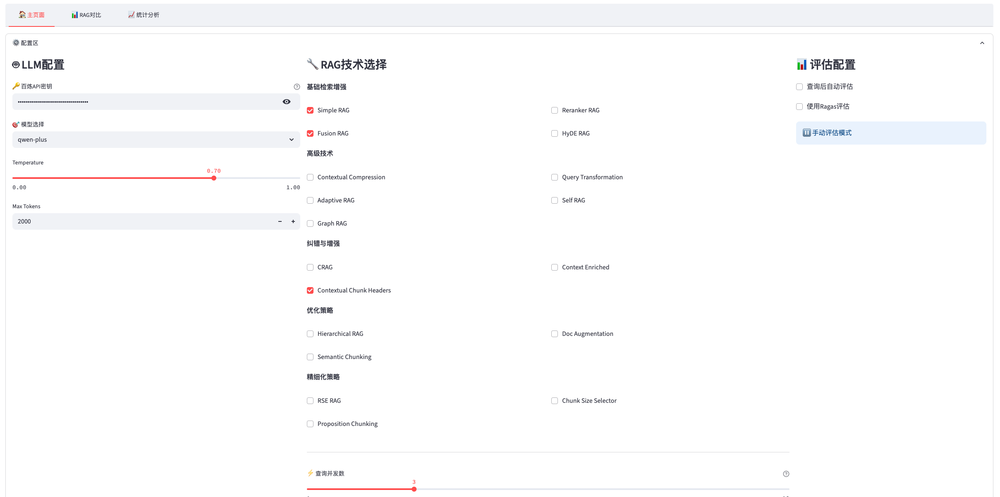
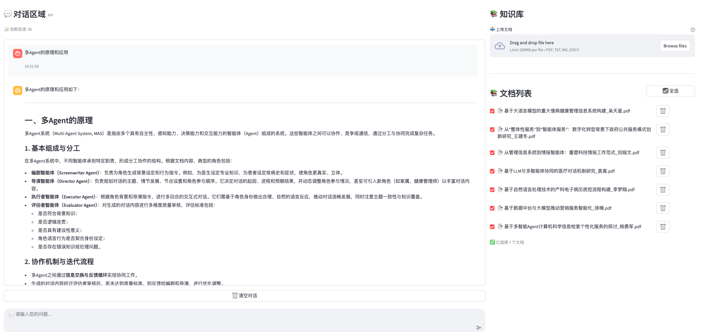
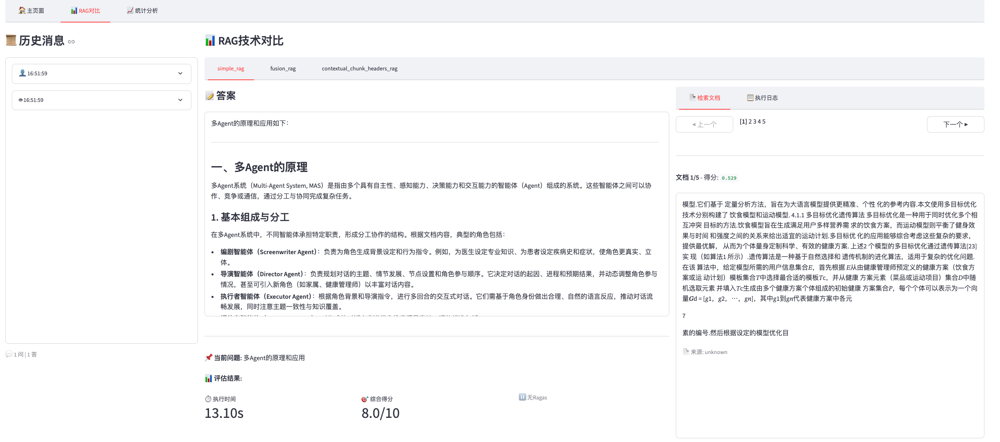
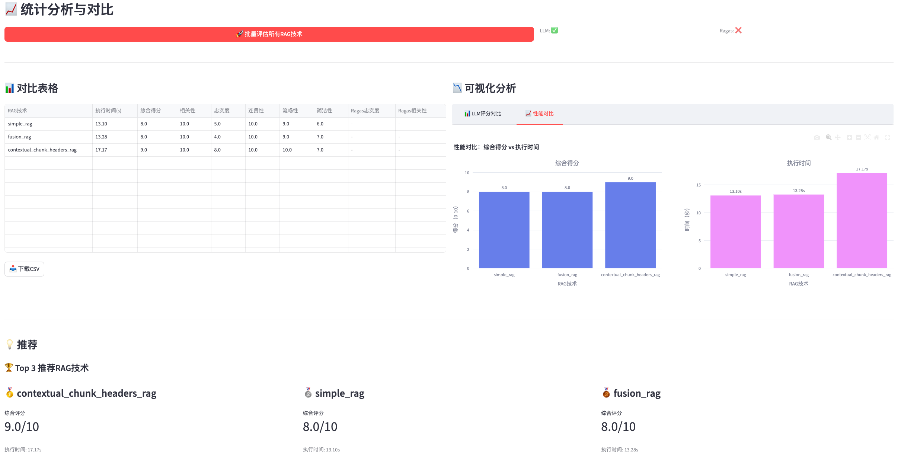
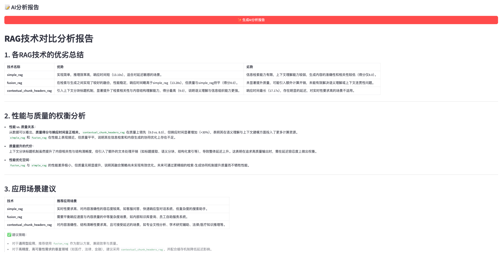

# 🤖 RAG评测对比平台 V1.9.7

> 一个功能完整的RAG技术评测与对比系统，支持20+种RAG技术，集成LLM和Ragas双重自动评估，帮助您找到最适合的RAG方案。

[](LICENSE)
[](https://www.python.org/)
[](CHANGELOG.md)
[](https://fastapi.tiangolo.com/)
[](https://streamlit.io/)

---

## 📋 目录

- [✨ 核心特性](#-核心特性)
- [🎬 快速演示](#-快速演示)
- [🚀 完整安装指南](#-完整安装指南)
- [📖 使用教程](#-使用教程)
- [🎯 功能详解](#-功能详解)
- [🔧 进阶配置](#-进阶配置)
- [❓ 常见问题](#-常见问题)
- [📚 开发文档](#-开发文档)

---

## ✨ 核心特性

### 🎯 20+种RAG技术，全面覆盖

| 类型 | 技术 | 特点 |
|------|------|------|
| 🌟 **基础增强** | Simple、Reranker、Fusion、HyDE | 易上手，效果稳定 |
| 🚀 **查询优化** | Query Transformation、Context Enrichment | 提升检索质量 |
| 🧠 **智能策略** | Adaptive、Self RAG、CRAG | 自适应调整 |
| 📊 **结构优化** | Hierarchical、Graph RAG、Semantic Chunking | 优化文档组织 |
| ⚙️ **高级技术** | Contextual Compression、Doc Augmentation、RSE | 专业场景 |

### 🤖 双重自动评估系统

**LLM智能评分** (6维度)
- ✅ 相关性 - 答案是否切题
- ✅ 忠实度 - 是否基于文档
- ✅ 连贯性 - 逻辑是否清晰
- ✅ 流畅性 - 语言是否自然
- ✅ 简洁性 - 表达是否精炼
- ✅ 综合得分 - 整体质量评价

**Ragas标准评估** (2-4指标)
- 📊 Faithfulness - 忠实度
- 📊 Answer Relevancy - 答案相关性
- 📊 Context Precision - 上下文精确度（可选）
- 📊 Context Recall - 上下文召回率（可选）

### 📊 专业可视化分析

- **对比表格**: 10+列完整数据，支持CSV导出
- **堆叠柱状图**: 5维度评分可视化，一目了然
- **并列柱状图**: 得分vs时间性能对比
- **智能推荐**: Top 3 RAG技术自动推荐
- **AI分析报告**: LLM生成的深度分析报告

### ⚡ 高性能架构

- 🔄 **并发查询**: 同时运行多个RAG技术（3-10并发）
- 🚀 **并发评估**: 加速批量评估流程
- 📝 **详细日志**: 完整记录每个步骤和中间数据
- 💾 **完整存储**: 所有查询和评估结果持久化

---

## 🎬 快速演示

### 主界面 - 配置与对话
配置LLM、选择RAG技术、上传文档，一站式完成。



### 对话界面 - 实时交互
与AI对话，查看不同RAG技术的回答效果。



### RAG对比页面 - 深度分析
切换不同RAG技术，查看答案、检索文档和执行日志。



### 统计分析页面 - 智能评估
批量评估、可视化对比、智能推荐。



### AI报告分析 - 深度洞察
一键生成专业的RAG技术分析报告。



---

## 🚀 完整安装指南

### 📋 系统要求

| 项目 | 要求 | 说明 |
|------|------|------|
| **操作系统** | macOS / Linux / Windows | 均支持 |
| **Python** | 3.8 - 3.11 | 推荐3.9+ |
| **内存** | 4GB+ | 8GB推荐 |
| **磁盘空间** | 10GB+ | 包含依赖和数据 |
| **网络** | 稳定连接 | 访问LLM API |

### 🔧 环境检查

运行以下命令检查环境：

```bash
# 检查Python版本
python --version
# 预期输出: Python 3.8.x 或更高

# 检查pip
pip --version
# 预期输出: pip 21.x.x 或更高

# 检查Git
git --version
# 预期输出: git version 2.x.x
```

---

### 📦 步骤1: 克隆项目

```bash
# 克隆项目到本地
git clone https://github.com/hwk-1212/rag_eval_project.git

# 进入项目目录
cd rag_eval_project/rag_all_app

# 查看文件结构
ls -la
```

**预期输出**:
```
backend/          # 后端服务
frontend/         # 前端界面
rag_techniques/   # RAG技术实现
requirements.txt  # 依赖列表
...
```

---

### 🐍 步骤2: 创建虚拟环境

**为什么需要虚拟环境？**
- ✅ 隔离项目依赖
- ✅ 避免版本冲突
- ✅ 便于环境管理

```bash
# 创建虚拟环境
python3 -m venv venv

# 激活虚拟环境
# Mac/Linux:
source venv/bin/activate

# Windows:
venv\Scripts\activate
```

**预期效果**: 终端提示符变为 `(venv) ...`

---

### 📚 步骤3: 安装依赖

#### 3.1 安装基础依赖（约2-3分钟）

```bash
# 方法1: 国内镜像（推荐）
pip install -r requirements.txt -i https://pypi.tuna.tsinghua.edu.cn/simple

# 方法2: 默认源
pip install -r requirements.txt
```

**预期输出**: 
```
Successfully installed fastapi-0.109.0 streamlit-1.31.0 ...
✅ 安装完成
```

#### 3.2 安装Ragas评估依赖（可选，约1分钟）

```bash
# 赋予执行权限
chmod +x install_ragas_deps.sh

# 执行安装脚本
./install_ragas_deps.sh
```

**预期输出**:
```
Installing Ragas and related dependencies...
✅ Ragas and dependencies installed successfully.
```

#### 3.3 安装Plotly可视化库（推荐，约30秒）

```bash
# 赋予执行权限
chmod +x install_plotly.sh

# 执行安装脚本（会自动尝试多个镜像源）
./install_plotly.sh
```

**预期输出**:
```
✅ Plotly安装成功! 版本: 5.18.0
```

**如果安装失败**，手动安装：
```bash
pip install plotly -i https://pypi.tuna.tsinghua.edu.cn/simple
```

---

### 🔑 步骤4: 配置API密钥

#### 4.1 创建配置文件

```bash
# 复制示例配置
cp .env.example .env

# 编辑配置文件
nano .env
# 或使用你喜欢的编辑器: vim .env / code .env
```

#### 4.2 填写API配置

在 `.env` 文件中配置：

```bash
# LLM API配置
OPENAI_API_KEY=sk-your-api-key-here
OPENAI_BASE_URL=https://dashscope.aliyuncs.com/compatible-mode/v1

# Embedding API配置（可选，默认使用LLM的配置）
EMBEDDING_API_KEY=sk-your-api-key-here
EMBEDDING_BASE_URL=https://dashscope.aliyuncs.com/compatible-mode/v1

# 默认模型
DEFAULT_LLM_MODEL=qwen-plus
DEFAULT_EMBEDDING_MODEL=text-embedding-v3
```

**支持的API提供商**:
- 阿里云百炼（推荐）
- OpenAI
- Azure OpenAI
- 其他兼容OpenAI API的服务

**获取API密钥**:
- 阿里云百炼: https://www.aliyun.com/product/bailian
- OpenAI: https://platform.openai.com/api-keys

---

### 🗄️ 步骤5: 初始化数据库（自动）

数据库会在首次启动时自动创建，无需手动操作。

如需手动初始化或迁移：

```bash
# 执行数据库迁移
python migrate_database.py
```

**预期输出**:
```
🚀 开始执行数据库迁移...
✅ 数据库初始化成功
🎉 数据库迁移完成！
```

---

### 🎯 步骤6: 启动服务

#### 6.1 启动后端服务

**打开第一个终端窗口**:

```bash
# 确保在项目目录
cd rag_eval_project/rag_all_app

# 激活虚拟环境
source venv/bin/activate

# 启动后端
cd backend
python main.py
```

**预期输出**:
```
==================================================
RAG评测对比平台启动中...
==================================================
数据库初始化成功
后端服务启动在: http://0.0.0.0:8000
API文档: http://0.0.0.0:8000/docs
INFO:     Application startup complete.
```

✅ **后端启动成功标志**: 看到 `Application startup complete.`

#### 6.2 启动前端服务

**打开第二个终端窗口**:

```bash
# 确保在项目目录
cd rag_eval_project/rag_all_app

# 激活虚拟环境
source venv/bin/activate

# 启动前端
streamlit run frontend/app.py
```

**预期输出**:
```
  You can now view your Streamlit app in your browser.

  Local URL: http://localhost:8501
  Network URL: http://192.168.x.x:8501
```

✅ **前端启动成功标志**: 浏览器自动打开或显示URL

---

### 🎉 步骤7: 访问应用

**自动打开**: 浏览器会自动打开 `http://localhost:8501`

**手动访问**: 
- 本地访问: http://localhost:8501
- 网络访问: http://你的IP:8501

**验证安装成功**:
- ✅ 看到"RAG评测对比平台"标题
- ✅ 左侧有"LLM配置"面板
- ✅ 中间有"RAG技术选择"
- ✅ 右侧有"知识库管理"

---

## 📖 使用教程

### 🎯 第一次使用 - 完整流程

#### 步骤1: 配置LLM


1. 在**LLM配置**区域：
   - 输入API Key
   - 输入API Base URL
   - 选择模型（如 `qwen-plus`）
   
2. 点击**测试连接**按钮验证配置

✅ **成功标志**: 显示"✅ 连接成功"

---

#### 步骤2: 选择RAG技术

在**RAG技术选择**区域：

1. **基础RAG**（推荐新手）：
   - ☑️ Simple RAG
   - ☑️ Fusion RAG

2. **高级RAG**（可选）：
   - ☑️ HyDE RAG
   - ☑️ Reranker RAG
   - ☑️ 其他...

**建议**: 首次使用选择2-3个技术对比

**设置参数**:
- **检索文档数(top_k)**: 5（默认）
- **RAG查询并发数**: 3（默认）
- **评估并发数**: 2（默认）

---

#### 步骤3: 上传文档


在**知识库管理**区域：

1. 点击**选择文件**按钮
2. 支持格式：
   - 📄 PDF (.pdf)
   - 📝 Word (.docx)
   - 📃 文本 (.txt)
   - 📊 Markdown (.md)

3. 选择文件后点击**上传**

**上传进度**:
```
正在上传: document.pdf
📄 提取文本...
✂️ 分块处理...
🔢 向量化...
💾 存储到Milvus...
✅ 文档上传成功！
```

**验证**: 文档列表中出现刚上传的文件

---

#### 步骤4: 开始对话


1. 在**对话区域**底部的输入框中输入问题
   ```
   示例问题：
   - "这篇文档的主要内容是什么？"
   - "关于XXX的解决方案有哪些？"
   - "请总结文档的核心观点"
   ```

2. 点击**发送**按钮或按`Ctrl+Enter`

3. 等待响应（会同时执行选中的所有RAG技术）

**响应显示**:
- 🤖 **用户**: 你的问题
- 🤖 **Simple RAG**: 第一种RAG的回答
- 🤖 **Fusion RAG**: 第二种RAG的回答
- 🤖 **...**: 其他RAG的回答

---

#### 步骤5: 查看RAG对比


切换到**RAG对比**页面（顶部标签页）：

**左侧 - 历史消息**:
- 查看所有问答历史
- 点击任意消息查看详情

**右侧 - RAG技术标签**:
- 切换不同的RAG技术
- 查看各自的回答

**答案展示区**:
- 📝 完整答案内容
- ⏱️ 执行时间

**右侧标签页**:
- 📚 **检索文档**: 查看检索到的文档片段
  - 支持分页浏览
  - 显示相似度分数
  - 显示文档来源
  
- 📋 **执行日志**: 查看详细执行过程
  - 总耗时分解
  - 检索步骤详情
  - 生成步骤详情
  - 中间数据统计

**当前问题和评估**:
- 显示当前查询
- 显示评估结果（如已评估）

---

#### 步骤6: 批量评估


切换到**统计分析**页面：

**配置评估参数**:
1. 在**评估配置**区域：
   - ☑️ 使用LLM评估
   - ☑️ 使用Ragas评估
   - 选择评估并发数（2-5推荐）

2. 点击**批量评估所有RAG技术**按钮

**评估进度**:
```
开始评估...
✅ Simple RAG 评估完成 (1/3)
✅ Fusion RAG 评估完成 (2/3)
✅ HyDE RAG 评估完成 (3/3)
🎉 批量评估完成！成功: 3/3
```

**查看结果**:

1. **对比表格** - 完整数据
   - RAG技术名称
   - 执行时间
   - 综合得分
   - 5个LLM评分维度
   - 2个Ragas评分
   - 支持下载CSV

2. **可视化图表** - 两个标签页
   
   **📊 LLM评分对比**:
   - 堆叠柱状图
   - 5个维度（相关性、忠实度、连贯性、流畅性、简洁性）
   - 颜色编码
   - 交互式悬停
   
   **📈 性能对比**:
   - 并列柱状图
   - 左图：综合得分
   - 右图：执行时间
   - 柱子上显示具体数值

3. **智能推荐** - Top 3
   - 🥇 第一名
   - 🥈 第二名
   - 🥉 第三名
   - 显示得分和时间

---

#### 步骤7: 生成AI分析报告


在**AI分析报告**区域：

1. 点击**✨ 生成AI分析报告**按钮

2. 等待LLM生成（约10-30秒）

3. 查看专业分析报告：
   - 📊 各RAG技术优劣总结
   - ⚖️ 性能和质量权衡分析
   - 🎯 应用场景建议
   - 💡 改进方向建议

4. 支持复制或导出报告内容

---

## 🎯 功能详解

### 1. RAG技术分类详解

#### 🌟 基础增强类（推荐新手）

| 技术 | 特点 | 适用场景 | 性能 |
|------|------|---------|------|
| **Simple RAG** | 最基础，易理解 | 快速原型，基准测试 | ⭐⭐⭐ |
| **Reranker RAG** | 重排序优化 | 提升检索准确性 | ⭐⭐⭐⭐ |
| **Fusion RAG** | 向量+BM25融合 | 平衡语义和关键词 | ⭐⭐⭐⭐ |
| **HyDE RAG** | 假设文档生成 | 抽象查询理解 | ⭐⭐⭐⭐ |
| **Contextual Compression** | 上下文压缩 | 长文档处理 | ⭐⭐⭐⭐ |

#### 🚀 查询优化类

| 技术 | 特点 | 适用场景 |
|------|------|---------|
| **Query Transformation** | 查询重写/分解 | 复杂问题拆解 |
| **Context Enriched** | 上下文扩展 | 需要更多背景信息 |
| **Contextual Chunk Headers** | 添加块头信息 | 提供文档结构 |

#### 🧠 智能策略类

| 技术 | 特点 | 适用场景 |
|------|------|---------|
| **Adaptive RAG** | 自适应策略选择 | 多样化查询 |
| **Self RAG** | 自我反思优化 | 高质量要求 |
| **CRAG** | 矫正检索 | 低相关度处理 |

#### 📊 结构优化类

| 技术 | 特点 | 适用场景 |
|------|------|---------|
| **Hierarchical Indices** | 层次化索引 | 大规模文档 |
| **Graph RAG** | 知识图谱 | 复杂关系推理 |
| **Semantic Chunking** | 语义分块 | 保持语义完整性 |
| **Doc Augmentation** | 文档增强 | 多模态检索 |

#### ⚙️ 高级技术类

| 技术 | 特点 | 适用场景 |
|------|------|---------|
| **RSE** | 句子级检索 | 精细粒度 |
| **Chunk Size Selector** | 动态块大小 | 自适应分块 |
| **Proposition Chunking** | 命题分块 | 事实型知识 |

---

### 2. 评估系统详解

#### LLM评分（6维度）

```
综合得分 = 平均(所有维度得分)

各维度权重相等，范围 0-10分
```

**评分标准**:

| 维度 | 0-2分 | 3-5分 | 6-8分 | 9-10分 |
|------|-------|-------|-------|--------|
| **相关性** | 完全不相关 | 部分相关 | 基本相关 | 高度相关 |
| **忠实度** | 无依据 | 部分依据 | 大部分依据 | 完全依据 |
| **连贯性** | 混乱 | 勉强连贯 | 基本连贯 | 非常连贯 |
| **流畅性** | 不通顺 | 勉强通顺 | 基本流畅 | 非常流畅 |
| **简洁性** | 冗长 | 略显冗余 | 基本精炼 | 高度精炼 |

#### Ragas评分（2-4指标）

**核心指标**（不需要标准答案）:
- **Faithfulness**: 答案是否基于检索的上下文（0-1）
- **Answer Relevancy**: 答案是否回答了问题（0-1）

**扩展指标**（需要标准答案）:
- **Context Precision**: 检索上下文的精确度（0-1）
- **Context Recall**: 检索上下文的召回率（0-1）

**得分解读**:
- `0.9+`: 优秀
- `0.7-0.9`: 良好
- `0.5-0.7`: 一般
- `<0.5`: 需改进

---

### 3. 并发与性能

#### RAG查询并发

```python
并发数 = 1-10（可配置）
推荐值 = 3

说明：
- 并发数越高，速度越快
- 但会占用更多LLM API配额
- 需根据API限制调整
```

**并发机制**:
- 使用ThreadPoolExecutor
- 每个线程独立数据库Session
- 线程安全的结果收集

#### 评估并发

```python
并发数 = 1-5（可配置）
推荐值 = 2

说明：
- 评估涉及多次LLM调用
- 并发可显著加速
- 过高并发可能触发API限流
```

#### 性能优化建议

| 场景 | RAG并发 | 评估并发 | 说明 |
|------|---------|---------|------|
| **测试/学习** | 2-3 | 1-2 | 稳定优先 |
| **日常使用** | 3-5 | 2-3 | 平衡性能 |
| **批量评估** | 5-8 | 3-5 | 速度优先 |
| **API受限** | 1-2 | 1 | 避免限流 |

---

## 🔧 进阶配置

### 自定义RAG参数

在**RAG配置**区域可调整：

```python
{
    "top_k": 5,              # 检索文档数
    "concurrent_num": 3,      # 查询并发数
    "temperature": 0.7,       # LLM温度
    "max_tokens": 2000,       # 最大token数
    "vector_weight": 0.5,     # 向量检索权重（Fusion）
    "bm25_weight": 0.5,       # BM25权重（Fusion）
    "rerank_top_k": 20,       # 重排序候选数（Reranker）
    # ... 更多参数
}
```

### 切换不同的LLM模型

**支持的模型**:
- 阿里云百炼: `qwen-plus`, `qwen-turbo`, `qwen-max`
- OpenAI: `gpt-3.5-turbo`, `gpt-4`, `gpt-4-turbo`
- 其他兼容模型

**切换方法**:
1. 在LLM配置中修改"模型名称"
2. 点击"测试连接"验证
3. 开始使用新模型

### 数据库迁移

如需迁移数据库结构：

```bash
# 执行迁移脚本
python migrate_database.py

# 查看迁移日志
cat logs/migration.log
```

### 自定义RAG技术

1. 在 `rag_techniques/` 目录创建新文件
2. 继承 `BaseRAG` 类
3. 实现 `retrieve()` 和 `generate()` 方法
4. 在 `backend/api/qa.py` 中注册新技术

**示例**:
```python
from rag_techniques.base import BaseRAG

class MyCustomRAG(BaseRAG):
    def __init__(self, vector_store, config=None):
        super().__init__("My Custom RAG", vector_store, config)
    
    def retrieve(self, query, top_k=5):
        # 实现检索逻辑
        pass
    
    def generate(self, query, retrieved_docs):
        # 实现生成逻辑
        pass
```

---

## ❓ 常见问题

### 安装相关

**Q1: pip install 失败，提示SSL错误？**

A: 使用国内镜像源：
```bash
pip install -r requirements.txt -i https://pypi.tuna.tsinghua.edu.cn/simple
```

**Q2: Plotly安装失败？**

A: 尝试多个镜像源：
```bash
bash install_plotly.sh
# 或
pip install plotly -i https://mirrors.aliyun.com/pypi/simple/
```

**Q3: Ragas安装后无法使用？**

A: 检查numpy版本兼容性：
```bash
pip install numpy==1.26.3
pip install ragas==0.1.7
```

### 使用相关

**Q4: 文档上传失败？**

A: 检查：
- 文件格式是否支持（PDF/DOCX/TXT/MD）
- 文件大小是否过大（建议<100MB）
- Milvus服务是否正常运行

**Q5: RAG查询没有响应？**

A: 检查：
- 后端服务是否正常运行
- LLM API配置是否正确
- 查看后端日志排查错误
- 网络连接是否正常

**Q6: 评估结果显示404？**

A: 这是正常的！评估结果404表示：
- 查询已完成，但还未评估
- 需要点击"批量评估"按钮
- 评估完成后会显示结果

**Q7: 并发查询出现数据库错误？**

A: V1.9.5已修复，确保：
- 使用最新版本代码
- 重启后端服务

**Q8: Ragas评估一直是0？**

A: V1.9.3已修复，确保：
- 安装了langchain-openai
- Ragas配置了LLM和Embeddings
- 上下文数据格式正确

### 性能相关

**Q9: 查询速度很慢？**

A: 优化建议：
- 增加RAG查询并发数（3-5）
- 减少检索文档数top_k（3-5）
- 使用更快的LLM模型

**Q10: 评估时间太长？**

A: 优化建议：
- 增加评估并发数（2-3）
- 关闭Ragas评估（仅用LLM）
- 减少评估的RAG技术数量

### 错误相关

**Q11: ModuleNotFoundError?**

A: 确保：
```bash
# 激活了虚拟环境
source venv/bin/activate

# 安装了所有依赖
pip install -r requirements.txt
```

**Q12: API调用失败？**

A: 检查：
- API Key是否正确
- API Base URL是否正确
- 网络是否能访问API服务
- API配额是否用尽

**Q13: 数据库错误？**

A: 尝试：
```bash
# 删除旧数据库
rm backend/database/rag_eval.db

# 重新运行后端（会自动创建）
cd backend && python main.py
```

---

## 📚 开发文档

### 项目结构

```
rag_all_app/
├── backend/                    # 后端服务
│   ├── api/                   # API路由
│   │   ├── documents.py       # 文档管理
│   │   ├── qa.py             # 问答接口
│   │   └── evaluation.py     # 评估接口
│   ├── core/                  # 核心功能
│   │   ├── vector_store.py   # 向量存储
│   │   ├── auto_evaluator.py # LLM评估
│   │   └── ragas_evaluator.py # Ragas评估
│   ├── models/                # 数据模型
│   │   ├── database.py       # 数据库配置
│   │   └── db_models.py      # ORM模型
│   ├── utils/                 # 工具函数
│   └── main.py               # 后端入口
│
├── frontend/                   # 前端界面
│   ├── pages/                 # 页面组件
│   │   ├── main_page.py      # 主页
│   │   ├── comparison_page.py # 对比页
│   │   └── statistics_page.py # 统计页
│   ├── components/            # UI组件
│   └── app.py                # 前端入口
│
├── rag_techniques/            # RAG技术实现
│   ├── base.py               # 基类
│   ├── simple_rag.py         # Simple RAG
│   ├── fusion_rag.py         # Fusion RAG
│   └── ...                   # 其他RAG
│
├── data/                      # 数据目录
│   ├── imgs/                 # 图片资源
│   └── uploads/              # 上传文件
│
├── logs/                      # 日志目录
├── requirements.txt           # 依赖列表
└── README.md                 # 本文档
```

### 技术栈

**后端**:
- FastAPI 0.109 - Web框架
- SQLAlchemy 2.0 - ORM
- Milvus Lite 2.4 - 向量数据库
- LangChain 0.1 - LLM框架
- Ragas 0.1.7 - RAG评估

**前端**:
- Streamlit 1.31 - Web UI
- Plotly 5.18 - 数据可视化
- Pandas 2.2 - 数据处理

**RAG技术**:
- PyMuPDF - PDF处理
- Jieba - 中文分词
- Rank-BM25 - 关键词检索
- NetworkX - 图算法（Graph RAG）

### API文档

启动后端后访问：http://localhost:8000/docs

**主要端点**:

```
POST /api/v1/documents/upload      # 上传文档
GET  /api/v1/documents/            # 获取文档列表
DELETE /api/v1/documents/{id}      # 删除文档

POST /api/v1/qa/query              # RAG查询
GET  /api/v1/qa/sessions           # 获取会话列表

POST /api/v1/evaluation/auto       # 自动评估
GET  /api/v1/evaluations/qa_record/{id}  # 获取评估结果
```

### 完整文档索引

- [RAG日志增强指南](LOG_ENHANCEMENT_GUIDE.md)
- [RAG日志增强总结](RAG_LOG_SUMMARY.md)
- [自动评估指南](AUTO_EVALUATION_GUIDE.md)
- [Ragas设置指南](RAGAS_SETUP_GUIDE.md)
- [数据库迁移指南](MIGRATION_GUIDE.md)
- [Uvloop修复文档](UVLOOP_FIX.md)

### 贡献指南

欢迎贡献！请：

1. Fork项目
2. 创建特性分支 (`git checkout -b feature/AmazingFeature`)
3. 提交更改 (`git commit -m 'Add some AmazingFeature'`)
4. 推送到分支 (`git push origin feature/AmazingFeature`)
5. 开启Pull Request

### 许可证

本项目采用 MIT 许可证 - 查看 [LICENSE](LICENSE) 文件了解详情

---

## 🎉 版本历史

### V1.9.7 (2025-10-15) - 最新版
- ✨ 优化性能对比可视化，使用并列柱状图
- 🐛 修复并发RAG查询数据库事务冲突
- 📝 完善README使用指南，添加页面截图

### V1.9.6 (2025-10-15)
- ✨ LLM评分使用堆叠柱状图展示5个维度
- 🔧 优化Ragas指标展示，只显示实际评估的指标

### V1.9.4 (2025-10-15)
- ✨ 完成4个代表性RAG技术的详细日志增强
- 📚 创建日志增强指南和批量增强工具

### V1.9.3 (2025-10-15)
- 🐛 修复Ragas评估的uvloop冲突和数据提取问题
- 📝 添加完整的Ragas设置和uvloop修复文档

### V1.9.0 (2025-10-15)
- ✨ 集成Ragas评估框架
- 💾 评估数据完整存储到数据库
- 📊 前端加载历史评估数据

### V1.5.0 (2025-10-13)
- ⚡ 实现RAG查询并发执行
- ⚡ 实现批量评估并发处理
- 📝 添加详细执行日志

### V1.0.0 (2025-10-12)
- 🎉 项目初始版本
- 🚀 支持20种RAG技术
- 🤖 LLM自动评估
- 📊 基础可视化对比

---

## 💬 支持与反馈

### 问题反馈

遇到问题？请：

1. 查看[常见问题](#-常见问题)
2. 查看[GitHub Issues](https://github.com/hwk-1212/rag_eval_project/issues)
3. 创建新Issue描述问题

### 功能建议

有新想法？欢迎：

1. 在GitHub创建Feature Request
2. 参与社区讨论
3. 提交Pull Request

### 联系方式

- 📧 Email: your-email@example.com
- 💬 GitHub: [@hwk-1212](https://github.com/hwk-1212)

---

## ⭐ Star History

如果这个项目对你有帮助，请给我们一个Star！⭐

---

**最后更新**: 2025-10-15  
**维护者**: @hwk-1212  
**状态**: 🟢 活跃维护中

---

<div align="center">

**感谢使用RAG评测对比平台！**

**希望这个工具能帮助您找到最适合的RAG解决方案！** 🚀

[🔝 回到顶部](#-rag评测对比平台-v197)

</div>
